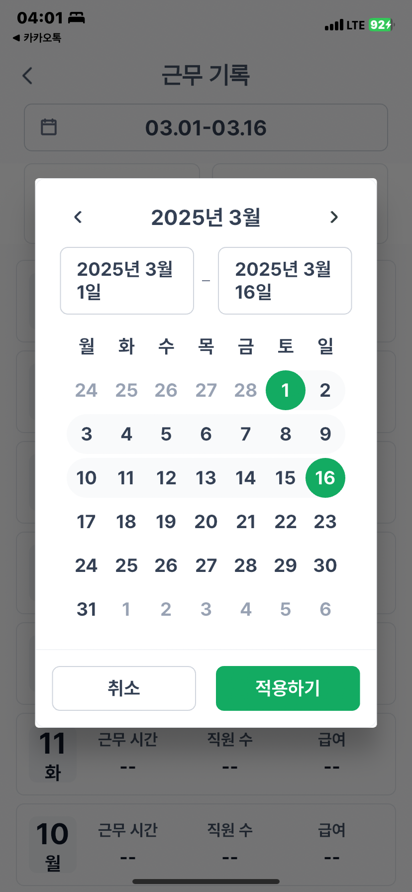
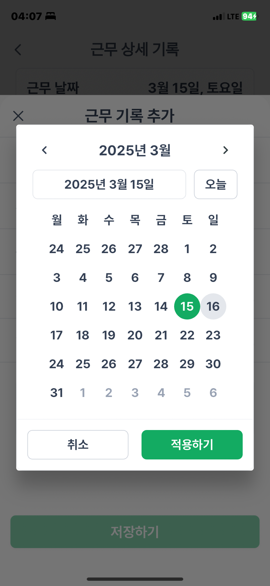
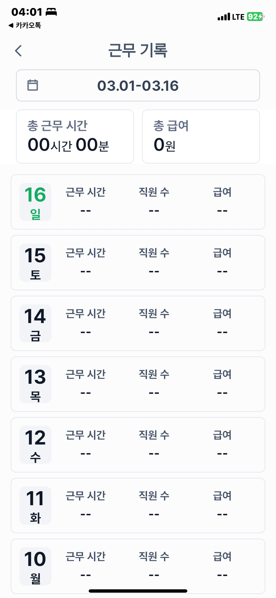
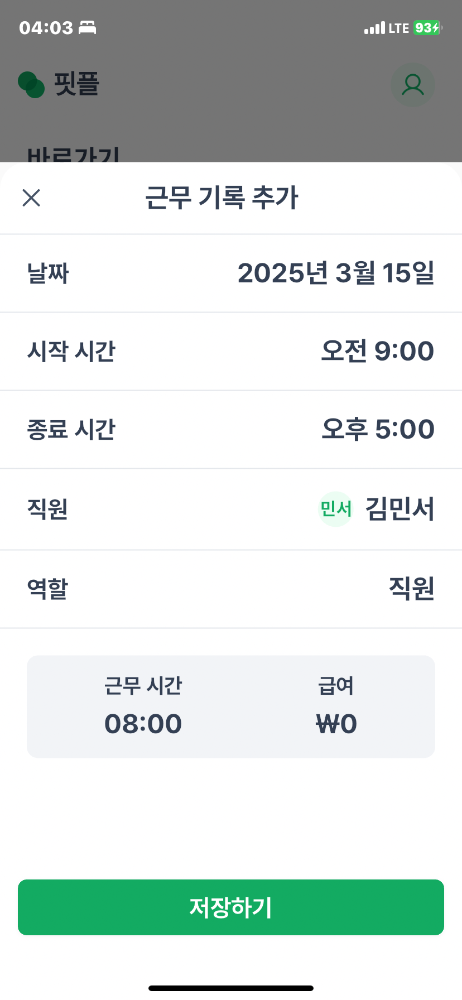
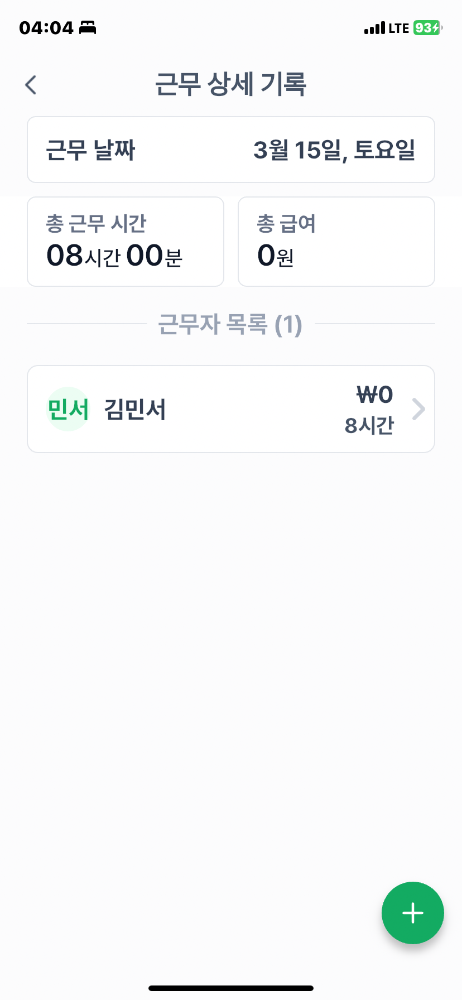
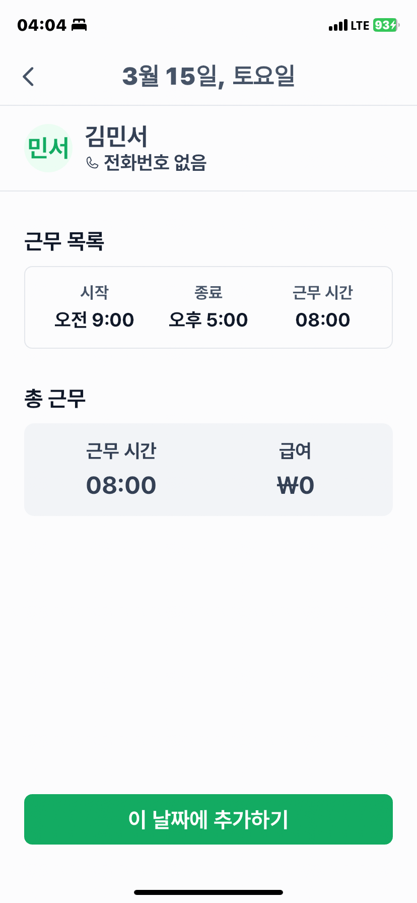

## 소상공인을 위한 근태관리 시스템 핏플 📋 

### 핏플
소상공인을 위한 근태관리 시스템으로, 사업장과 직원을 등록하여 효과적인 근태관리를 수행할 수 있습니다. 

  

### 🚀 기술 스택

  

### 근태관리 
- 커스텀 캘린더를 이용하여 근태기록 확인 시작일~종료일까지의 근태 기록을 확인할 수 있습니다.
- 근무 기록에서 수행한 시간이 지나면, 사용자가 근무 완료를 지정하고 해당 데이터가 근무 완료 시에, 근무 기록으로 기록됩니다. 
- 캘린더를 통해 지정한 날짜의 모든 근태기록을 간략하게 리스트로 나타낼 수 있습니다. 
- 사용자 친화적 UX를 위해 근무 기록 추가 화면에서도 날짜를 변경할 수 있습니다.
- 근무 기록을 수정, 삭제 할 수 있습니다. 
- 상대 크기를 사용하여 화면 크기에 반응하는 반응형 UI로 구현하였습니다.

---

#### 커스텀 캘린더 구현
사용자가 근무 기록을 보다 더 원활하게 이용하기 위해 커스텀 캘린더를 구현하였습니다. 시작-종료 날짜를 사용자가 확실히 확인하기 위하여, 색 변경과 시작-종료 까지의 이어짐 처리와 같은 UI 요소들을 구현하였습니다. 

|  |  |
|----------------|----------------|

#### 

#### 근무 기록 기능 구현
|  |  |
|----------------|----------------|
|  |  |

